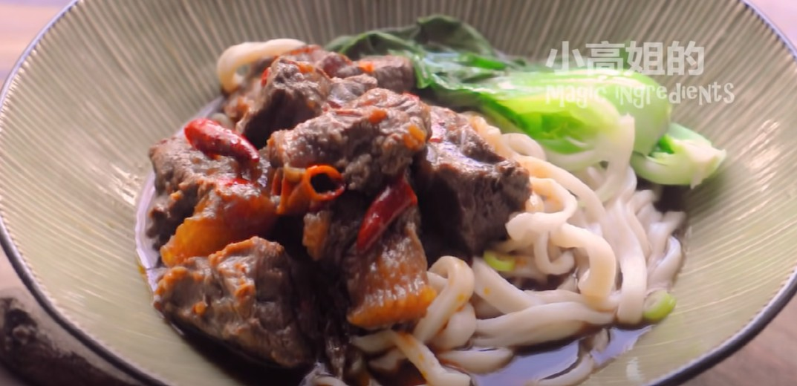

*[Home](https://wanlicn.github.io/restaurant/)*
## Beef Noodle Soup
[红烧牛肉面-YouTube-小高姐视频](https://www.youtube.com/watch?v=Q8kLOh1s1d0)

### Recipt:

**Ingredient:**
* Main
  * Beef shank
  * Water
* Group 1
  * Dried chili: 8
  * Green Sichuan peppercorns: 1 tbsp
  * Oil: 1 tbsp
  * Chopped onions: 1/2 cup
* Group 2
  * Ginger: 1
  * Star anise: 3
  * Cinnamon stick: 1
  * Regulor Soy sauce: 1/4
  * Dark Soy sauce: 1/8
  * Spicy Soy paster: 1 tbsp
  * Salt: 1tsp

**Noodles**
- All purpose flour: 2 cup
- Salt: 1/4 tsp
- Water: 3/4 cup + 1 tsp adjustment
- Bok choy (青菜)

### Steps:
- Step 0-1: **Boil the beef**
1. Put the beef shank in the boilling water for 10 minutes, and wash away the blood
2. Cut the beef shank into small pieces along the texture
- Step 0-2: **Prepare dried chili**
1. Cut the dried chili into small piece, soak them into water for 30 minutes
2. filter the chili from the water
- Step 1: **Cook the beef with Dark soy sauce**
1. Put the chili, Chopped onion, peppercorn, oil into the stewpot, fried for flavor
2. put the beef into the stewpot, cook for a while
3. Put the water(hot) into the stewpot
4. Add Group2 ingredents
5. boil the mixture and cook with low heat for 2 hours
- Step 2: **prepare noodles**
1. Mix powder, salt and water into a dough
2. rest for 30 minutes with stretch film
3. Flatten the dough and rest for another 30 minutes
4. Roll the dough flat
5. Brush oil on the both sides of the dough
6. rest the flatten dough for 2 hours with stretch film
7. Cut the dough into slice and drag the slice at two ends, a noodle would be done
- Step 3: **Cook the noodle with beef**
1. Boil the water
2. Put the noodle into boilded water for 1 minute
3. Boil some bok choy
4. Put the noodle and Bok choy into a bowl
5. Add the beef with the soap
6. All is done

### Enjoy the meal!
