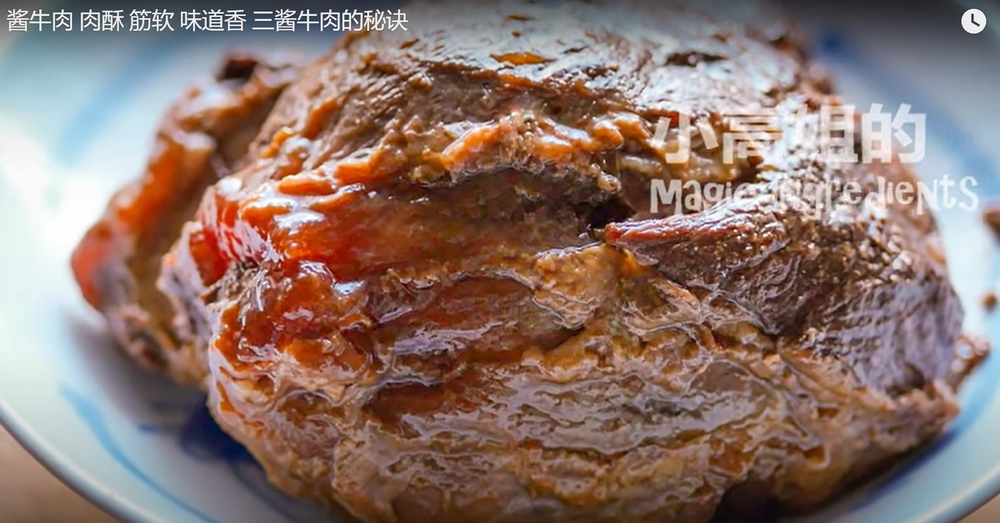

*[Home](https://wanlicn.github.io/restaurant/)*
## Sauced Beef
[酱牛肉-YouTube-小高姐视频](https://www.youtube.com/watch?v=esz2fBMGkPE)

### Recipe:

**Ingredients:**
* Main:
  * Beef shank: 1500 g
* Group 1
  * Regulor soy sauce: 270 g
* Group 2
  * Sichuan peppercorn: 1 tbsp (5g)
  * Star anise: 4 (3g)
  * Cinnamon stick: 1 (3g)
  * Black cardamom: 1 (2g)
  * Bay leaves: 4 (1g)
  * Dried orange peel: 1 (2g)
  * Dried hawthorn fruit: 5 (3g)
  * Dried Chili 6 (5g)
  * Ginger: 1 piece (42g)
  * Onion: 1/4 (60g)
  * Sweet bean paste 1/2 cup (160g)
  * fermented bean curd: 3 piece (25g)
  * Salt: adjustable amount

### Steps:
1. Soak the beef shank in the regulor soy sauce (Group1)
2. Store in fridge (refregerator) for the whole night
3. Add some water in the sauce (submerge the beef)
4. Blanching the content
5. Skim off the foam
6. Add Group2 ingredients into the sauce
7. Heat on low heat for 2.5 hours
8. Store the sauce and beef in fridge for the whole night after it cool down
9. Cut the beef into slice
10. All is done

### Enjoy the Meal!
