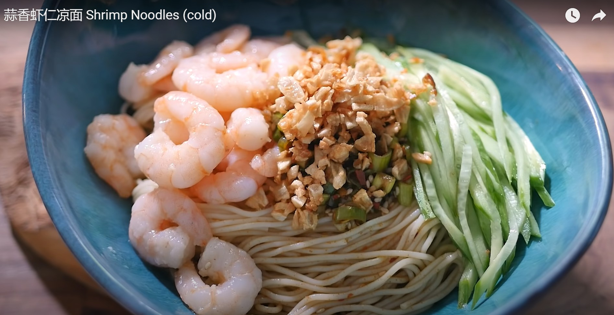

*[Home](https://wanlicn.github.io/restaurant/)*
## Shrimp Noodles (cold)

[蒜香虾仁凉面](https://www.youtube.com/watch?v=sjEP07HHKC8)

### Recipe:
**Ingredients**
* Main: (3 servings)
  * Capellini: a small handful 
  * Shrimp: 600 g
  * Cucumber: 2  
* group 1
  * Salt:1/8 tsp
  * White pepper powder: 1/8 tsp
  * Corn Starch: 1 tsp 
* group 2
  * Garlic: 1 head
 
 **Sauce**
* Group 3
  * Green onions: 2
  * Chili powder: 1 tbsp
  * Sesame: 1 tbsp
  * Salt: 1/4 tsp
* Group 4
  * Sesame oil: 1 tbsp
  * Chinese vinegar: 1 tbsp
  * Regular Soy sauce: 1 tbsp
  * Fish Sauce: 1 tbsp
  * Sugar: 1 tsp
  * Water: 2 tbsp
  * Oil: as needed

### Steps:
- Step 1: **Prepare the noodles**
1. Boil the noodles for 7 minutes over low heat
2. filter the noodles out of the water
3. Add some oil to prevent sticky together
4. Store in fridge
- Step 2: **fry the gralic**
1. Chop the gralic
2. fry the chopped gralic out flavor
3. Pick out the gralic
- Step 3: **Prepare shrimp**
4. Mix shrimp with group1
5. Fry the shrimp with the oil (used for garlic)
6. Pick out the shrimp
- Step 4: **Prepare sauce**
1. Pure the hot oil (used in step3) into the Group1 ingredents 
2. Mixed with Group4 ingredents

**Serving**
  - noodles, shrimp, chopped garlic, sauce, cucumber

### Enjoy the meal!
