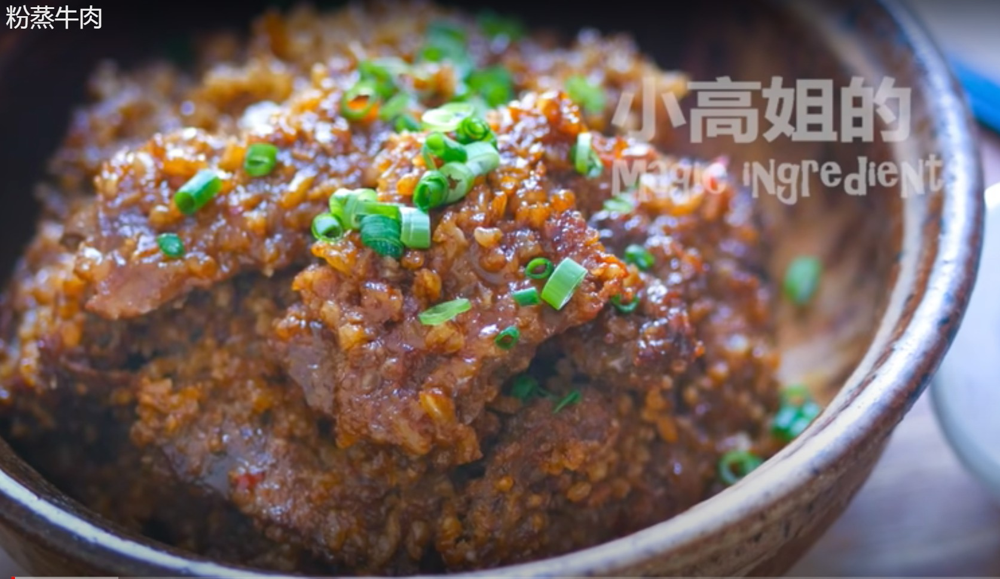

*[Home](https://wanlicn.github.io/restaurant/)*
## Steamed Beef with Rice

[粉蒸牛肉](https://www.youtube.com/watch?v=5Q4HACvSNQI)

### Recipe:

**Ingredients**
* Main:
  * Beef tenderlion:500 g
  * Baking soda: 1 tbsp
* group 1
  * Spicy bean paste 1 tsp
  * Fermented tofu: 2 piece
  * Ginger paste: 1 tsp
  * Brown sugar: 1 tsp
  * Sichuan pepper powder: 1/4 tsp
  * White pepper powder: 1/4 tsp
  * Five-spice powder: 1/4
  * Regular soy sauce: 1 tbsp
  * Dark soy sauce: 1 tbsp
* group 2
  * Rice: 1/3 cup
  * Glutinous rice: 1/3 cup
  * Star anise: 2 
  * Bay leaves: 3
  * Cinnamon stick: 1
  * Clove: 4
* group 3
  * Water: 100-120 g
  * Oil: 2 tbsp

**Garlic oil**
 - Garlic: 7 cloves
 - Chili powder: 1.5 tbsp
 - Sesame: 1 tbsp
 - Salt: 1/4 tsp
 - Sichuan pepper powder: 1/4 tsp
 - Oil(hot): 1/3 cup
 - Seasame oil: tsp
 1. Mix all the spicy substance
 2. heat the Oil and pure on the mixture
 3. Add seasame oil

### Steps:
- Step 0: **Wash the beef**
1. Submerge the beef in water for 10 minutes, and wash away the blood
- Step 1: **Marinate the beef**
1. Mix the baking soda with the beef thoroughly
2. Mix the beef with all the Ingredient group-1, marinated for 1 hour
- Step 2: **Prepare rice**
1. Frying the group-2 ingredient in the pan until the rice turned a bit brown
2. Pick out the spices
3. Break the brown rice with a blender (do not into powder)
- Step 3: **Mix the beef and rice**
1. Mix the ground rice with the beef
2. Add some water
3. Add some Oil
- Step 4: **Steaming the beef**
1. Put the beef in a bowl with a lid
2. Boil the water in the steamer
3. put the bowl into the steamer
4. Steamed on low heat for 55 minutes
5. All is done

### Enjoy the meal!
